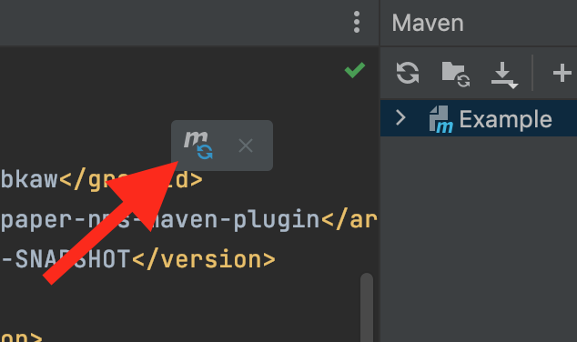
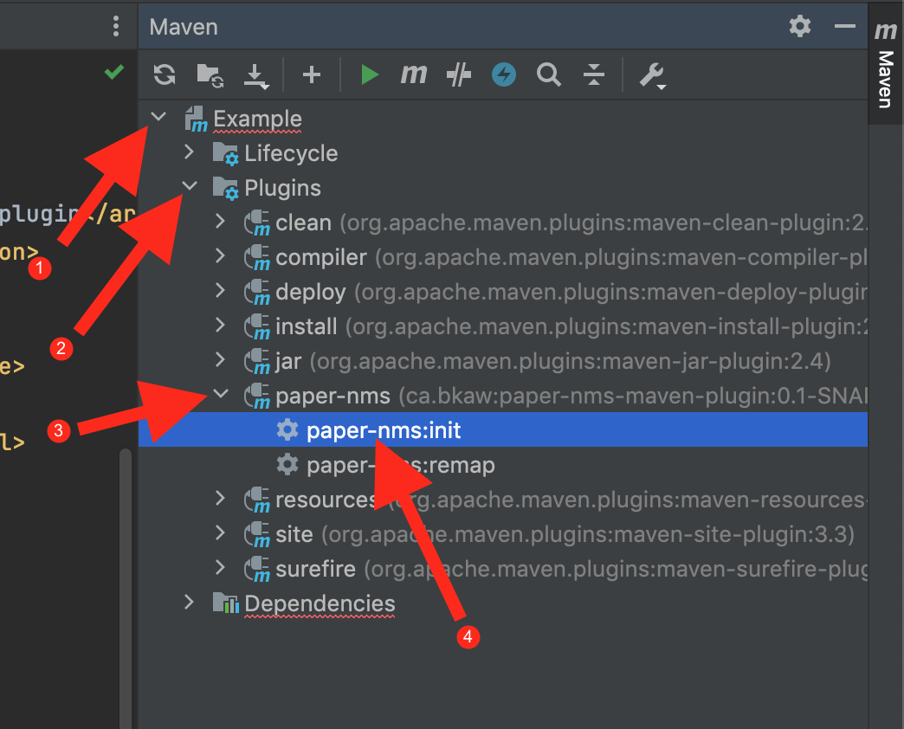

# paper-nms-maven-plugin
A maven plugin for using NMS on [Paper](https://github.com/PaperMC/Paper) with Mojang mappings.

This plugin will both create the mapped paper dependency and install it to your local repository, and remap your artifact back to spigot mappings.

> [!NOTE]
> This is an unofficial plugin. You probably want to use Gradle and the officially supported [paperweight-userdev](https://github.com/PaperMC/paperweight-test-plugin) plugin instead. Do not ask PaperMC for support regarding this plugin. Instead, direct message `alvinn8` on discord and I will try to help you.

## Usage (IntelliJ)
1. Add `.paper-nms` to your `.gitignore`.

2. Add the plugin and its repository to your `pom.xml`:
```xml
<pluginRepositories>
    ...
    <pluginRepository>
        <id>bytecode.space</id>
        <url>https://repo.bytecode.space/repository/maven-public/</url>
    </pluginRepository>
    ...
</pluginRepositories>

<build>
    <plugins>
        ...
        <plugin>
            <groupId>ca.bkaw</groupId>
            <artifactId>paper-nms-maven-plugin</artifactId>
            <version>1.4.4</version>
            <executions>
                <execution>
                    <phase>process-classes</phase>
                    <goals>
                        <goal>remap</goal>
                    </goals>
                </execution>
            </executions>
        </plugin>
        ...
    </plugins>
</build>
```

3. Add the mojang mapped dependency to your `pom.xml`.
```xml
<dependency>
    <groupId>ca.bkaw</groupId>
    <artifactId>paper-nms</artifactId>
    <version>1.21.4-SNAPSHOT</version>
    <scope>provided</scope>
</dependency>
```

Change `1.21.4` to the desired version.

4. Reload the project.



A `Cannot resolve ca.bkaw:paper-nms:1.21.4-SNAPSHOT` message is expected.

5. To create the missing dependency, run `init`.

For arrow (4), double-click `paper-nms:init` to run it.

6. Wait for `init` to finish and a `BUILD SUCCESS` message should appear. The `paper-nms` dependency should now exist.

7. Done! Your project should now have a Mojang mapped paper dependency, and when you build you project (for example with `mvn package`) the artifact will be remapped back to spigot mappings.

## Usage with NMS modules that depend on each other

If you have multiple modules that use NMS that depend on each other and that will be shaded into one jar, the plugin needs to be configured in a different way.

> Note that this only applies if you have multiple NMS modules that __depend on each other__ and that will __shade each other__.

Let's say you have two modules, `api` and `plugin`. Both of these modules use NMS. `api` has an interface that uses NMS types, and `plugin` implements this interface. The `plugin` module shades the `api` module.

To use the plugin with this setup it needs to remap the resulting shaded jar file instead of remapping classes.

1. In the `api` module, remove the executions part of the plugin configuration so that it doesn't remap that module.
2. In the `plugin` module, change the remap goal to run during the `package` phase instead of `process-classes`, and make sure the paper-nms-maven-plugin is located __after__ the maven-shade-plugin.

This way the plugin will remap the jar file after it has been shaded, and all shaded dependencies will also be remapped.

See [issue #16](https://github.com/Alvinn8/paper-nms-maven-plugin/issues/16) (Closed) for more information.

## Mojang mappings in runtime on Paper 1.20.5+
Paper 1.20.5+ uses a Mojang-mapped runtime instead of using Spigot mappings in runtime. If you want to support Spigot you can continue to use the `paper-nms-maven-plugin` like before.

If you are targeting Paper and do not care about Spigot compatibility, you can disable remapping of your plugin back to Spigot mappings. To do so, add the following to your `pom.xml`:

```xml
<plugin>
    <groupId>org.apache.maven.plugins</groupId>
    <artifactId>maven-jar-plugin</artifactId>
    <version>3.4.1</version>
    <configuration>
        <archive>
            <manifestEntries>
                <paperweight-mappings-namespace>mojang</paperweight-mappings-namespace>
            </manifestEntries>
        </archive>
    </configuration>
</plugin>
```
and remove the `executions` part of the `paper-nms-maven-plugin` plugin.

## Troubleshooting: `remap failed: Duplicate key`
Delete the file `.paper-nms/classes.json` and try again.

## Usage with paper forks
You can specify a custom dev bundle to use NMS with paper forks.

This is done by configuring the plugin as follows.
```xml
<plugin>
    <groupId>ca.bkaw</groupId>
    <artifactId>paper-nms-maven-plugin</artifactId>
    <version>...</version>
    <executions>...</executions>
    <configuration>
        <devBundle>
            <!-- The artifact id of the resulting dependency -->
            <id>forktest-nms</id>
            <!-- The repository to download the dev-bundle from -->
            <repository>
                <id>myrepo</id>
                <url>https://repo.example.com/repository/maven-public/</url>
            </repository>
            <!-- The artifact to download -->
            <artifact>
                <groupId>com.example.paperfork</groupId>
                <artifactId>dev-bundle</artifactId>
                <version>${gameVersion}-R0.1-SNAPSHOT</version>
                <!-- ${gameVersion} will be replaced with the game version to use -->
            </artifact>
        </devBundle>
    </configuration>
</plugin>
...
<dependencies>
    <dependency>
        <!-- Custom dev bundles get the group id ca.bkaw.nms instead of just ca.bkaw -->
        <groupId>ca.bkaw.nms</groupId>
        <artifactId>forktest-nms</artifactId> <!-- Note that this is forktest-nms -->
        <version>1.21.4-SNAPSHOT</version>
        <scope>provided</scope>
    </dependency>
</dependencies>
```

Run `paper-nms:init`. The `paper-nms-maven-plugin` will downloading the dev bundle from the specified repository and generate the dependency.

The repository can be omitted and the dev bundle will be fetched from maven local.

It is also possible to omit the `url` from the `repository` tag if you already have defined a repository with the same `id` in the `repositories` tag of your pom.xml.

If the repository requires authentication, prefer specifying the `id` of the repository and define the repository in the `repositories` tag of your pom.xml.

## Issues
### Only works for 1.17 and higher
On some older spigot versions, mappings use a package rename to avoid having to retype `net/minecraft/server` for every class mapping. See [issue #2](https://github.com/Alvinn8/paper-nms-maven-plugin/issues/2).

In the future all versions down to 1.14.4 should be supportable as there are Mojang mappings available since then.

## Disclaimer
You probably want to use Gradle and [paperweight-userdev](https://github.com/PaperMC/paperweight-test-plugin) instead.

Please bear the licence of the Mojang mappings in mind.

Not affiliated with Minecraft, Mojang or Microsoft.

Not affiliated with Paper or PaperMC.

Not affiliated with Maven or The Apache Software Foundation.
